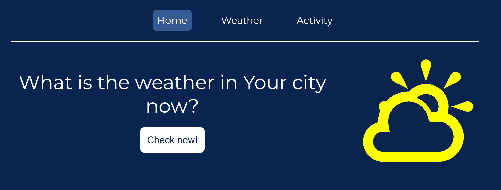
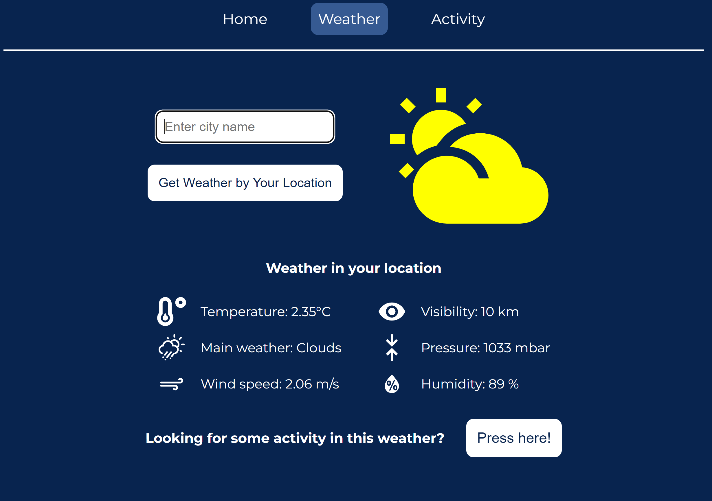

# Weather App

## About

This application allows users to check the weather in two ways: by using their geolocation or inputting the name of the city. Additionally, users have the option to receive a random activity suggestion based on the current weather.

## Screenshots


*This is the homepage of the weather application.*


*This is a detailed view of the weather page.*


*An example of the generated weather.*


*This is the activity page displaying a randomly generated activity based on the current weather.*

## Installation

To get started, install the required NPM packages by running:

```bash
npm install
# or
yarn
# or
pnpm install
# or
bun install
```

## Getting Started

First, run the development server:

```bash
npm run dev
# or
yarn dev
# or
pnpm dev
# or
bun dev
```

Open [http://localhost:3000](http://localhost:3000) with your browser to see the result.

## Stack's used:

Next.js React.js Axios Node.js HTML CSS Git

## Frameworks:
 styled-components, useQuery